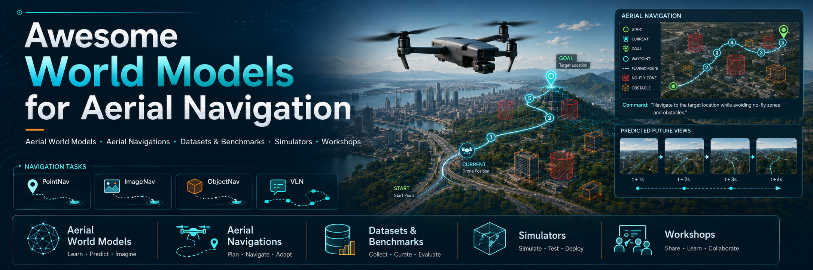
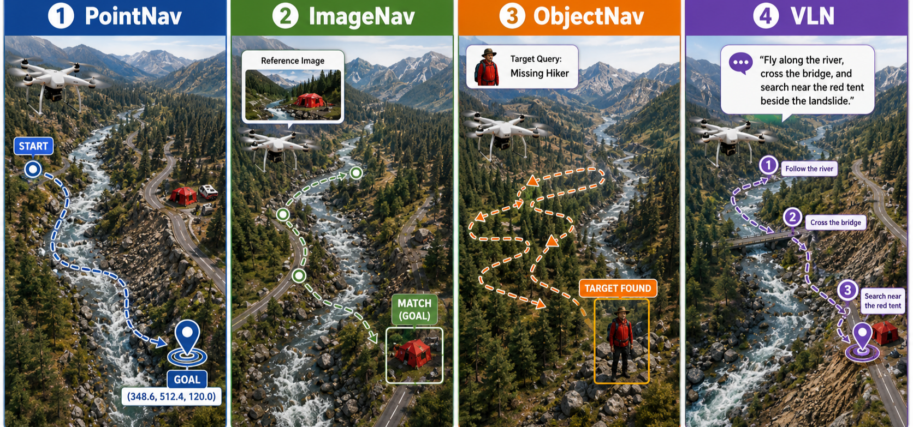

# Awesome World Models for Aerial Navigation

  

A repository for aerial world models and UAV embodied navigation, covering methods, benchmarks, datasets, simulators, and workshops.

**Quick Links:** [Tasks](#tasks) · [Surveys](#Surveys) · [Aerial World Models](#AWM) · [Aerial Embodied Navigation](#AEN) · [Datasets & Benchmarks](#datasets) · [Simulators](#sim)

## Aerial Navigation Task

This repository prioritizes **aerial world models** and **UAV embodied navigation**. Pure mapping, detection, segmentation, VQA abd remote sensing works are included only when they directly support embodied navigation, benchmark construction, simulator development, or world-model training.

| Task | Name | Precise Definition |
| --- | --- | --- |
| `PointNav` | Point-goal Navigation | The UAV is given a geometric goal, such as a 2D/3D coordinate, waypoint, or relative displacement, and must reach the target location from an unseen start pose using onboard observations and executable motion actions. |
| `ImageNav` | Image-goal Navigation | The UAV is given a goal image depicting a target place, view, landmark, or object instance, and must navigate to the physical location or viewpoint that matches the image under viewpoint, scale, and appearance changes. |
| `ObjectNav` | Object-goal Navigation | The UAV is given a semantic object goal, object category, object description, or target instance, and must search for, localize, and stop near the target object in an unseen aerial environment. |
| `VLN` | Vision-and-Language Navigation | The UAV receives natural-language navigation instructions or goal descriptions and must ground them in visual observations, reason over aerial spatial relations, and execute sequential actions to reach the instructed destination. |
<!-- 

  

 -->

## Surveys

| Date | Venue | Paper | Links |
| --- | --- | --- | --- |
| 2026-04 | arXiv | Vision-Language Navigation for Aerial Robots: Towards the Era of Large Language Models | [Paper](https://arxiv.org/abs/2604.07705) |
| 2025-02 | arXiv | The Role of World Models in Shaping Autonomous Driving: A Comprehensive Survey | [Paper](https://arxiv.org/abs/2502.10498) [Repo](https://github.com/LMD0311/Awesome-World-Model) |
| 2024-03 | arXiv | World Models for Autonomous Driving: An Initial Survey | [Paper](https://arxiv.org/abs/2403.02622) |
| 2023-12 | arXiv | Foundation Models in Robotics: Applications, Challenges, and the Future | [Paper](https://arxiv.org/abs/2312.07843) [Repo](https://github.com/robotics-survey/Awesome-Robotics-Foundation-Models) |

## Aerial World Models

| Date | Venue | Paper | Links |
| --- | --- | --- | --- |
| 2026-06 | arXiv | MAD: Mapping-Aware World Models for Agile Quadrotor Flight | [Paper](https://arxiv.org/abs/2606.04534) |
| 2026-06 | arXiv | AirDreamer: Generalist Drone Navigation with World Models | [Paper](https://arxiv.org/abs/2606.03252) |
| 2026-06 | arXiv | ImagineUAV: Aerial Vision-Language Navigation via World-Action Modeling and Kinodynamic Planning | [Paper](https://arxiv.org/abs/2606.01205) |
| 2026-06 | arXiv | WorldFly: A World-Model-Based Vision-Language-Action Model for UAV Navigation | [Paper](https://arxiv.org/abs/2606.06147) |
| 2026-05 | arXiv | DeTrack: A Benchmark and Altitude-Aware Dual World Model for Drone-embodied Tracking | [Paper](https://arxiv.org/abs/2605.17451) |
| 2026-05 | arXiv | Aero-World: Action-Conditioned Aerial Video Generation from Inertial Controls | [Paper](https://arxiv.org/abs/2605.19728) |
| 2026-05 | arXiv | FlyMirage: A Fully Automated Generation Pipeline for Diverse and Scalable UAV Flight Data via Generative World Model | [Paper](https://arxiv.org/abs/2605.19600) |
| 2026-05 | arXiv | WorldVLN: Autoregressive World Action Model for Aerial Vision-Language Navigation | [Paper](https://arxiv.org/abs/2605.15964) [Project](https://embodiedcity.github.io/WorldVLN/) |
| 2025-12 | arXiv | Aerial World Model for Long-horizon Visual Generation and Navigation in 3D Space | [Paper](https://arxiv.org/abs/2512.21887) |
| 2025-09 | arXiv | FlightDiffusion: Revolutionising Autonomous Drone Training with Diffusion Models Generating FPV Video | [Paper](https://arxiv.org/abs/2509.14082) |
| 2025-07 | ACM MM | AirScape: An Aerial Generative World Model with Motion Controllability | [Paper](https://arxiv.org/abs/2507.08885) [Code](https://github.com/EmbodiedCity/AirScape.code) [Project](https://embodiedcity.github.io/AirScape/) [Dataset](https://huggingface.co/datasets/EmbodiedCity/AirScape-Dataset) |

## Aerial Embodied Navigation

| Date | Venue | Paper | Links |
| --- | --- | --- | --- |
| 2026-05 | arXiv | ESARBench: A Benchmark for Agentic UAV Embodied Search and Rescue | [Paper](https://arxiv.org/abs/2605.01371) [Project](https://4amgodvzx.github.io/ESAR.github.io/) |
| 2026-03 | arXiv | UAVBench and UAVIT-1M: Benchmarking and Enhancing MLLMs for Low-Altitude UAV Vision-Language Understanding | [Paper](https://arxiv.org/abs/2603.14336) [Project](https://UAVBench.github.io/) |
| 2026-02 | arXiv | APEX: A Decoupled Memory-based Explorer for Asynchronous Aerial Object Goal Navigation | [Paper](https://arxiv.org/abs/2602.00551) [Code](https://github.com/4amGodvzx/apex) |
| 2026-01 | arXiv | AirNav: A Large-Scale Real-World UAV Vision-and-Language Navigation Dataset with Natural and Diverse Instructions | [Paper](https://arxiv.org/abs/2601.03707) |
| 2025-12 | arXiv | MM-UAVBench: How Well Do Multimodal Large Language Models See, Think, and Plan in Low-Altitude UAV Scenarios? | [Paper](https://arxiv.org/abs/2512.23219) |
| 2025-11 | arXiv | OpenVLN: Open-world aerial Vision-Language Navigation | [Paper](https://arxiv.org/abs/2511.06182) |
| 2025-11 | arXiv | UAVBench: An Open Benchmark Dataset for Autonomous and Agentic AI UAV Systems via LLM-Generated Flight Scenarios | [Paper](https://arxiv.org/abs/2511.11252) [Code](https://github.com/maferrag/UAVBench) |
| 2025-11 | arXiv | AirCopBench: A Benchmark for Multi-drone Collaborative Embodied Perception and Reasoning | [Paper](https://arxiv.org/abs/2511.11025) |
| 2025-08 | arXiv | UAV-ON: A Benchmark for Open-World Object Goal Navigation with Aerial Agents | [Paper](https://arxiv.org/abs/2508.00288) |
| 2025-07 | arXiv | RingMo-Agent: A Unified Remote Sensing Foundation Model for Multi-Platform and Multi-Modal Reasoning | [Paper](https://arxiv.org/abs/2507.20776) |
| 2025-06 | arXiv | Grounded Vision-Language Navigation for UAVs with Open-Vocabulary Goal Understanding | [Paper](https://arxiv.org/abs/2506.10756) |
| 2025-05 | arXiv | LogisticsVLN: Vision-Language Navigation For Low-Altitude Terminal Delivery Based on Agentic UAVs | [Paper](https://arxiv.org/abs/2505.03460) |
| 2025-04 | arXiv | UAV-VLN: End-to-End Vision Language guided Navigation for UAVs | [Paper](https://arxiv.org/abs/2504.21432) |
| 2024-11 | arXiv | NavAgent: Multi-scale Urban Street View Fusion For UAV Embodied Vision-and-Language Navigation | [Paper](https://arxiv.org/abs/2411.08579) |
| 2024-08 | arXiv | AeroVerse: UAV-Agent Benchmark Suite for Simulating, Pre-training, Finetuning, and Evaluating Aerospace Embodied World Models | [Paper](https://arxiv.org/abs/2408.15511) |
| 2023-11 | arXiv | GeoChat: Grounded Large Vision-Language Model for Remote Sensing | [Paper](https://arxiv.org/abs/2311.15826) [Code](https://github.com/mbzuai-oryx/geochat) |
| 2023-08 | ICCV | AerialVLN: Vision-and-Language Navigation for UAVs | [Paper](https://arxiv.org/abs/2308.06735) [Code](https://github.com/AirVLN/AirVLN) |

## Navigation Datasets & Benchmarks

| Date | Venue | Data & Bench | Task | Note | Links |
| --- | --- | --- | --- | --- | --- |
| 2026-05 | arXiv | ESARBench | ObjectNav | ESARBench: A Benchmark for Agentic UAV Embodied Search and Rescue | [Paper](https://arxiv.org/abs/2605.01371) [Project](https://4amgodvzx.github.io/ESAR.github.io/) |
| 2026-02 | arXiv | APEX | ObjectNav | APEX: A Decoupled Memory-based Explorer for Asynchronous Aerial Object Goal Navigation | [Paper](https://arxiv.org/abs/2602.00551) [Code](https://github.com/4amGodvzx/apex) |
| 2026-02 | AAAI | U2UData+ | ObjectNav | U2UData+: A Scalable Swarm UAVs Autonomous Flight Dataset for Embodied Long-horizon Tasks | [Paper](https://ojs.aaai.org/index.php/AAAI/article/view/37158) [Project](https://fengtt42.github.io/U2UData-2/) [Code](https://github.com/fengtt42/U2UData-2) [Dataset](https://fengtt42.github.io/U2UData-2/) |
| 2026-01 | arXiv | AirNav | VLN | AirNav: A Large-Scale Real-World UAV Vision-and-Language Navigation Dataset with Natural and Diverse Instructions | [Paper](https://arxiv.org/abs/2601.03707) |
| 2025-11 | arXiv | OpenVLN | VLN | OpenVLN: Open-world Aerial Vision-Language Navigation | [Paper](https://arxiv.org/abs/2511.06182) |
| 2025-08 | ACM MM | UAV-ON | ObjectNav | UAV-ON: A Benchmark for Open-World Object Goal Navigation with Aerial Agents | [Paper](https://arxiv.org/abs/2508.00288) |
| 2025-05 | arXiv | LogisticsVLN | VLN | LogisticsVLN: Vision-Language Navigation For Low-Altitude Terminal Delivery Based on Agentic UAVs | [Paper](https://arxiv.org/abs/2505.03460) |
| 2025-05 | arXiv | CityAVOS | ObjectNav | CityAVOS: Towards Autonomous UAV Visual Object Search in City Space | [Paper](https://arxiv.org/abs/2505.08765) |
| 2025-04 | arXiv | UAV-VLN | VLN | UAV-VLN: End-to-End Vision Language Guided Navigation for UAVs | [Paper](https://arxiv.org/abs/2504.21432) |
| 2025-02 | arXiv | OpenFly | VLN | OpenFly: A Versatile Toolchain and Large-scale Benchmark for Aerial Vision-Language Navigation | [Paper](https://arxiv.org/abs/2502.18041) [Project](https://shailab-ipec.github.io/openfly/) [Code](https://github.com/Eziotic/OpenFly) |
| 2025 | ICCV | CityNav | VLN | CityNav: A Large-Scale Dataset for Real-World Aerial Navigation | [Paper](https://arxiv.org/abs/2406.14240) [Project](https://water-cookie.github.io/city-nav-proj/) [Code](https://github.com/water-cookie/citynav-arxiv) |
| 2024-10 | ICLR | OpenUAV | ObjectNav / VLN | Towards Realistic UAV Vision-Language Navigation: Platform, Benchmark, and Methodology | [Paper](https://arxiv.org/abs/2410.07087) [Project](https://prince687028.github.io/OpenUAV/) [Code](https://github.com/buaa-colalab/TravelUAV) |
| 2024-08 | ACM MM | U2UData | ObjectNav | U2UData: A Large-scale Cooperative Perception Dataset for Swarm UAVs Autonomous Flight | [Paper](https://arxiv.org/abs/2408.00606) [ACM](https://dl.acm.org/doi/10.1145/3664647.3681151) [Code](https://github.com/fengtt42/U2UData) [Dataset](https://github.com/fengtt42/U2UData) |
| 2024-08 | arXiv | AeroVerse | PN/IN/VLN | AeroVerse: UAV-Agent Benchmark Suite for Simulating, Pre-training, Finetuning, and Evaluating Aerospace Embodied World Models | [Paper](https://arxiv.org/abs/2408.15511) |
| 2023-08 | ICCV | AerialVLN | VLN | AerialVLN: Vision-and-Language Navigation for UAVs | [Paper](https://arxiv.org/abs/2308.06735) [Code](https://github.com/AirVLN/AirVLN) [Dataset](https://github.com/AirVLN/AirVLN) |
| 2020-10 | ACM MM | University-1652 | ImageNav | University-1652: A Multi-view Multi-source Benchmark for Drone-based Geo-localization | [Paper](https://dl.acm.org/doi/10.1145/3394171.3413896) [Code](https://github.com/layumi/University1652-Baseline) [Dataset](https://github.com/layumi/University1652-Baseline) |

## Aerial Other Dataset

| Date | Venue | Dataset / Resource | Data Type | Note | Links |
| --- | --- | --- | --- | --- | --- |
| 2026-05 | arXiv | AeroBench | Generation | Aero-World: Action-Conditioned Aerial Video Generation from Inertial Controls | [Paper](https://arxiv.org/abs/2605.19728) |
| 2026-03 | arXiv | UAVBench + UAVIT-1M | Vision-Language Understanding | UAVBench and UAVIT-1M: Benchmarking and Enhancing MLLMs for Low-Altitude UAV Vision-Language Understanding | [Paper](https://arxiv.org/abs/2603.14336) [Project](https://UAVBench.github.io/) |
| 2025-12 | arXiv | ANWM | Generation / Navigation Support | Aerial World Model for Long-horizon Visual Generation and Navigation in 3D Space | [Paper](https://arxiv.org/abs/2512.21887) |
| 2025-12 | arXiv | MM-UAVBench | Vision-Language Understanding / Planning | MM-UAVBench: How Well Do Multimodal Large Language Models See, Think, and Plan in Low-Altitude UAV Scenarios? | [Paper](https://arxiv.org/abs/2512.23219) |
| 2025-07 | ACM MM | AirScape | Generation / World Model | AirScape: An Aerial Generative World Model with Motion Controllability | [Paper](https://arxiv.org/abs/2507.08885) [Project](https://embodiedcity.github.io/AirScape/) [Code](https://github.com/EmbodiedCity/AirScape.code) [Dataset](https://huggingface.co/datasets/EmbodiedCity/AirScape-Dataset) |
| 2025-07 | arXiv | RingMo-Agent | Remote Sensing Reasoning | RingMo-Agent: A Unified Remote Sensing Foundation Model for Multi-Platform and Multi-Modal Reasoning | [Paper](https://arxiv.org/abs/2507.20776) |
| 2024-08 | NeurIPS Datasets and Benchmarks | UAV3D | 3D Perception | UAV3D: A Large-scale 3D Perception Benchmark for Unmanned Aerial Vehicles | [Paper](https://arxiv.org/abs/2410.11125) [Project](https://huiyegit.github.io/UAV3D_Benchmark/) [Code](https://github.com/huiyegit/UAV3D) |
| 2023-11 | arXiv | GeoChat Dataset | Remote Sensing VQA / Reasoning | GeoChat: Grounded Large Vision-Language Model for Remote Sensing | [Paper](https://arxiv.org/abs/2311.15826) [Code](https://github.com/mbzuai-oryx/geochat) |
| 2021-06 | arXiv | LoveDA | Segmentation | LoveDA: A Remote Sensing Land-Cover Dataset for Domain Adaptive Semantic Segmentation | [Paper](https://arxiv.org/abs/2110.08733) [Code](https://github.com/Junjue-Wang/LoveDA) |
| 2020-01 | arXiv | VisDrone | Detection / Tracking | Vision Meets Drones: A Challenge | [Dataset](https://github.com/VisDrone/VisDrone-Dataset) |
| 2019-05 | CVPRW | iSAID | Instance Segmentation | iSAID: A Large-scale Dataset for Instance Segmentation in Aerial Images | [Website](https://captain-whu.github.io/iSAID/) |
| 2018-10 | arXiv | UAVid | Semantic Segmentation | UAVid: A Semantic Segmentation Dataset for UAV Imagery | [Paper](https://arxiv.org/abs/1810.10438) [Website](https://uavid.nl/) |
| 2018-04 | ECCV / arXiv | UAVDT | Detection / Tracking | The Unmanned Aerial Vehicle Benchmark: Object Detection and Tracking | [Paper](https://arxiv.org/abs/1804.00518) |
| 2018-02 | arXiv | xView | Detection | xView: Objects in Context in Overhead Imagery | [Paper](https://arxiv.org/abs/1802.07856) |
| 2017-11 | CVPR / arXiv | DOTA | Detection | DOTA: A Large-scale Dataset for Object Detection in Aerial Images | [Paper](https://arxiv.org/abs/1711.10398) [Website](https://captain-whu.github.io/DOTA/) |

---

## Simulators

| Simulator | Type | Good For | Links |
| --- | --- | --- | --- |
| AirSim | Unreal / Unity simulator | Photorealistic UAV simulation, data collection, APIs | [Code](https://github.com/microsoft/AirSim) [Docs](https://microsoft.github.io/AirSim/) [Paper](https://arxiv.org/abs/1705.05065) |
| Flightmare | Unity + physics quadrotor simulator | RL, planning, visual-inertial odometry | [Code](https://github.com/uzh-rpg/flightmare) [Website](https://uzh-rpg.github.io/flightmare/) [Paper](https://arxiv.org/abs/2009.00563) |
| gym-pybullet-drones | PyBullet / Gymnasium | Single/multi-agent quadcopter control and RL | [Code](https://github.com/learnsyslab/gym-pybullet-drones) [Paper](https://arxiv.org/abs/2103.02142) |
| PyFlyt | PyBullet / Gymnasium / PettingZoo | UAV RL and multi-agent experiments | [Code](https://github.com/jjshoots/PyFlyt) [Docs](https://taijunjet.com/PyFlyt/documentation.html) |

---

## Workshops

| Year | Event | Topic | Links |
| --- | --- | --- | --- |
| 2025 | CVPR Workshop & Challenge, OpenDriveLab | World models and embodied navigation | [Website](https://opendrivelab.com/challenge25/#1x-wm) |
| 2025 | World Model Bench @ CVPR | Benchmarking world models | [Website](https://worldmodelbench.github.io/) |

---

Awesome World Models for Aerial Navigation.
